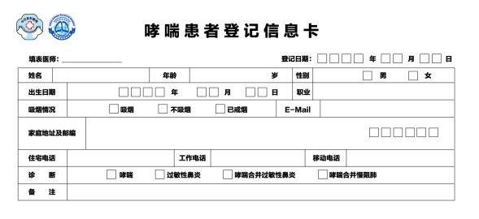
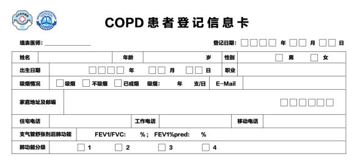
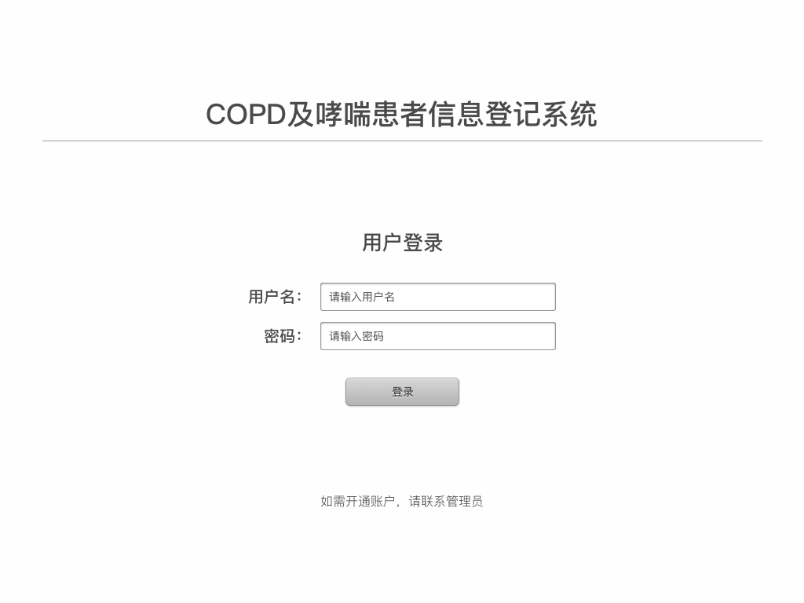
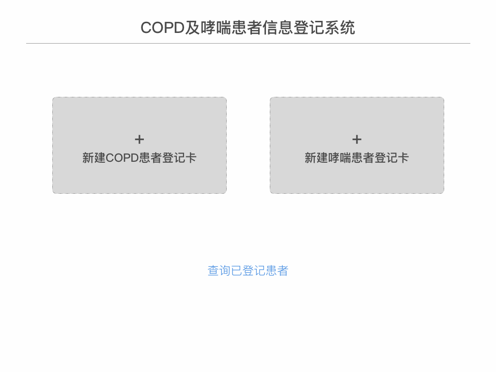
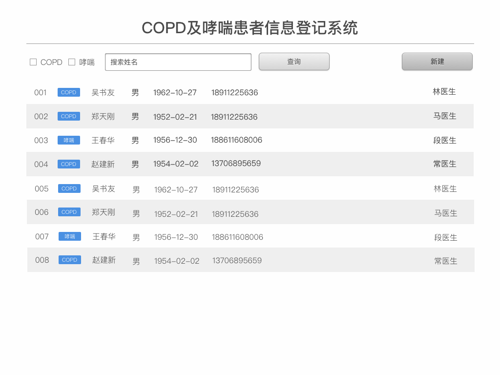

# 哮喘及COPD患者登记卡

图1：哮喘患者登记信息卡

图2：COPD患者登记信息卡

## 系统功能（v1.0）

### 管理员
* 登录及退出
* 新建录入员
* 录入登记数据
* 按条件查询所有登记卡（列表及详情）
* 导出数据（Excel）

### 录入员
* 登录及退出
* 录入登记数据
* 查询自己录入的数据

## 系统界面设计
#### 登录页

#### 主页

#### 患者列表

